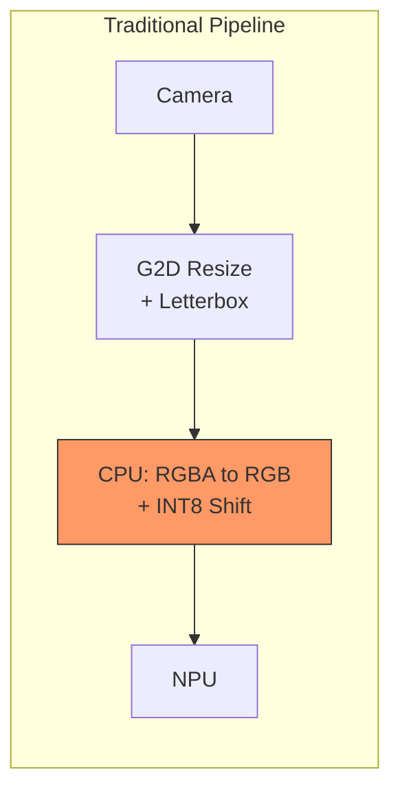
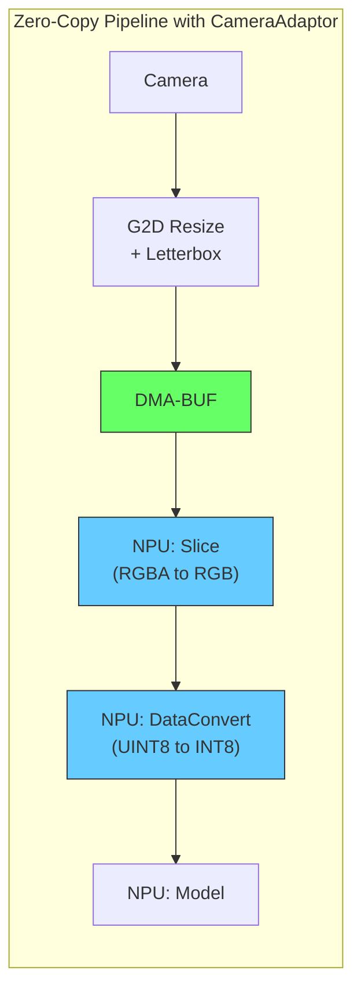

# CameraAdaptor for TIM-VX

## Overview

Modern camera sensors and video pipelines output formats (RGBA, YUYV, NV12) that differ from what ML models expect (typically RGB). Traditional approaches require CPU-based conversion before inference, adding latency and memory bandwidth overhead. CameraAdaptor solves this by injecting format conversion operations directly into the TIM-VX compute graph, enabling true zero-copy camera-to-NPU pipelines.

**Key benefits:**
- **Saves 5.7-9.2 ms of CPU preprocessing per frame** (~8-12% faster) for 640x640 inputs
- **Zero CPU involvement in data transfer** -- G2D writes directly to DMA-BUF consumed by NPU
- **No accuracy loss** -- produces identical inference results to CPU-based conversion
- **No model changes required** -- works with any pre-trained TFLite model

This document extends [DMABUF.md](DMABUF.md) with camera-specific preprocessing. Read DMABUF.md first for DMA-BUF zero-copy fundamentals.

### Runtime vs Training-time CameraAdaptor

EdgeFirst provides CameraAdaptor implementations for both runtime and training:

| Implementation | When | Best For |
|----------------|------|----------|
| **Runtime (this)** | Inference | Pre-trained models, multi-platform deployment |
| **[Training-time](https://github.com/EdgeFirstAI/cameraadaptor)** | Training | Maximum performance, camera-specific optimization |

The **runtime CameraAdaptor** injects preprocessing operations into the TIM-VX graph at inference time. This is ideal for pre-trained models or when the same model needs to run on multiple platforms with different camera formats without retraining.

The **training-time CameraAdaptor** modifies the model architecture during training to natively learn from camera formats. Instead of converting YUYV to RGB, the first convolution learns directly from YUYV data -- no conversion needed at inference time.

This document covers the runtime implementation.

## Architecture

CameraAdaptor replaces CPU-based preprocessing with NPU operations injected into the TIM-VX compute graph. Combined with DMA-BUF, this creates a fully hardware-accelerated pipeline where camera data flows from G2D to NPU without CPU involvement.





Both pipelines use G2D hardware for resize and letterbox. The CameraAdaptor pipeline eliminates the CPU-bound stages that follow:

1. **RGBA to RGB conversion** -- replaced by NPU Slice operation (1.54 ms vs 6.18 ms on CPU)
2. **UINT8 to INT8 quantization shift** -- replaced by NPU DataConvert (folded into graph at near-zero additional cost)
3. **CPU memcpy** -- eliminated entirely via DMA-BUF zero-copy (G2D writes directly to NPU-readable memory)

### Supported Format Conversions

| Input Format | Output Format | NPU Operations | Status |
|--------------|---------------|----------------|--------|
| RGBA/BGRA/RGBX/etc. | RGB | Slice | Implemented |
| RGBA/BGRA/RGBX/etc. | BGR | Slice + Reverse | Implemented |
| RGB | RGB | Passthrough | Implemented |
| BGR | BGR | Passthrough | Implemented |
| YUYV | RGB | ColorConvert | Planned |
| NV12 | RGB | ColorConvert | Planned |
| Bayer | RGB | Demosaic | Planned |

### Quantization Support

CameraAdaptor automatically handles UINT8 to INT8 conversion for INT8 quantized models while maintaining full DMA-BUF zero-copy:

| Model Input | Camera Data | NPU Operations |
|-------------|-------------|----------------|
| UINT8 | UINT8 | Slice [+ Reverse] |
| INT8 | UINT8 | Slice [+ Reverse] + DataConvert |

The DataConvert operation handles UINT8 to INT8 conversion using quantization parameters:

- **Camera input**: UINT8 with `scale=s, zero_point=0` -- real = uint8 x s
- **Model input**: INT8 with `scale=s, zero_point=-128` -- real = (int8 + 128) x s

For equal real values: `int8 = uint8 - 128`

```
UINT8(0)   -> INT8(-128)   // Black pixel
UINT8(128) -> INT8(0)      // Mid-gray
UINT8(255) -> INT8(127)    // White pixel
```

## Integration

### Enabling CameraAdaptor

```c
// 1. Create delegate with DMA-BUF enabled
VxDelegateOptions options = VxDelegateOptionsDefault();
options.enable_dmabuf = true;
TfLiteDelegate* delegate = VxDelegateCreate(&options);

// 2. Configure CameraAdaptor for input tensor
int input_tensor_idx = interpreter->inputs()[0];
VxCameraAdaptorSetFormat(delegate, input_tensor_idx, "rgba");

// 3. Register DMA-BUF for zero-copy
TfLiteBufferHandle handle = VxDelegateRegisterDmaBuf(
    delegate, dmabuf_fd, buffer_size, kVxDmaBufSyncNone);
VxDelegateBindDmaBufToTensor(delegate, handle, input_tensor_idx);

// 4. Apply delegate (injects preprocessing ops into graph)
interpreter->ModifyGraphWithDelegate(delegate);
```

### C API Reference

```c
// Set format using string identifier
TfLiteStatus VxCameraAdaptorSetFormat(
    TfLiteDelegate* delegate,
    int input_tensor_index,
    const char* format);  // "rgba", "bgra", "rgb", "bgr"

// Set input and output formats explicitly
TfLiteStatus VxCameraAdaptorSetFormats(
    TfLiteDelegate* delegate,
    int input_tensor_index,
    const char* camera_format,  // "rgba", "bgra", etc.
    const char* model_format);  // "rgb" or "bgr"

// Query functions
bool VxCameraAdaptorIsSupported(const char* format);
int VxCameraAdaptorGetInputChannels(const char* format);   // e.g., 4 for RGBA
int VxCameraAdaptorGetOutputChannels(const char* format);  // e.g., 3 for RGB
```

## Benchmark Results

### Reference: NNStreamer Legacy Pipeline

The [NNStreamer YOLOv8 benchmark](../nnstreamer-yolov8/BENCHMARK.md) provides a reference measurement of the traditional CPU-based preprocessing pipeline on the same i.MX 8M Plus platform with a live camera (OS08A20, 1920x1080, NV12 @ 30fps, YOLOv8n 640x640 INT8):

| Stage | Time (ms) | Type |
|-------|-----------|------|
| G2D Scale + Colorspace (NV12 to RGBA, resize) | 4.51 | Hardware |
| Letterbox padding (videobox, 140px borders) | 2.55 | **CPU** |
| RGBA to RGB extraction (tensor_transform #1) | 3.75 | **CPU** |
| INT8 shift (tensor_transform #2) | 1.86 | **CPU** |
| **Preprocessing total** | **12.80** | |
| NPU inference (VIP8000) | 70.81 | Hardware |
| Post-processing (YOLOv8 decode + NMS) | ~5.3 | CPU |
| **E2E total** | **89.03** | |
| **Throughput** | **11.2 FPS** | |

The CPU preprocessing stages total **8.16 ms per frame**. This is the overhead that CameraAdaptor eliminates by moving format conversion to the NPU and pre-filling letterbox padding at initialization.

### CameraAdaptor vs Legacy Copy

**Test configuration:**
- **Platform**: NXP i.MX 8M Plus FRDM (imx8mp-frdm)
- **NPU**: Vivante VIP8000 (2.25 TOPS)
- **Model**: YOLOv8n 640x640 INT8 quantized (1.2 MB input tensor)
- **Test image**: zidane.jpg (1280x720)
- **Pipeline**: Image -> G2D resize (letterbox) -> NPU inference
- **Iterations**: 20 iterations + 5 warmup

| Mode | Resize (ms) | CPU Copy (ms) | NPU (ms) | Total (ms) | Saved (ms) |
|------|-------------|---------------|----------|------------|------------|
| Legacy copy (RGB) | 5.30 | 8.54 | 68.12 | 81.96 | -- |
| **CameraAdaptor (RGB)** | 5.53 | **0.00** | 67.23 | **72.76** | **9.20** |
| Legacy copy (RGBA) | 4.09 | 6.18 | 68.18 | 78.45 | -- |
| **CameraAdaptor (RGBA)** | 4.03 | **0.00** | 68.77 | **72.80** | **5.65** |

CameraAdaptor provides an **~8-12% improvement** by eliminating all CPU copy overhead. The NPU Slice operation that replaces CPU RGBA to RGB conversion costs only 1.54 ms vs 6.18 ms on CPU -- **NPU is 4x faster**.

All modes produce identical detections (2 persons in zidane.jpg at 81-85% confidence).

### Validation Against NNStreamer Reference

Our legacy copy benchmarks align with the NNStreamer camera pipeline, confirming the measurements are representative of real-world performance:

| Metric | NNStreamer (camera) | Local legacy (copy-rgb) |
|--------|---------------------|-------------------------|
| G2D resize | 4.51 ms | 5.30 ms |
| CPU preprocessing | 8.16 ms | 8.54 ms |
| NPU inference | 70.81 ms | 68.12 ms |
| E2E (adjusted)* | 89.03 ms | ~89.8 ms |

*Local E2E adjusted by adding ~5.3 ms post-processing and ~2.5 ms per-frame letterbox (both excluded from our benchmark loop).

The CPU preprocessing cost is nearly identical despite different operations: NNStreamer performs letterbox padding + RGBA to RGB stride extraction + INT8 shift across three GStreamer elements (8.16 ms), while our legacy copy performs a single RGB memcpy from uncached DMA memory (8.54 ms). Both represent the same fundamental bottleneck -- CPU reading ~1.2 MB of data from DMA-engine output buffers at ~142 MB/s DRAM bandwidth.

## File Structure

```
tflite-vx-delegate-imx/
+-- camera_adaptor/
|   +-- camera_adaptor.h/cc   # CameraAdaptor class
|   +-- color_space.h/cc      # ColorSpace enum + FourCC utilities
|   +-- config.h/cc           # Configuration
|   +-- converters/
|       +-- alpha_drop_converter.cc  # Slice + Reverse + DataConvert
+-- vx_delegate_dmabuf.h/cc   # C API
+-- delegate_main.cc          # Graph injection
```

## Test Cases

The test harness `camera_adaptor_test` validates that all pipeline modes (legacy copy and DMA zero-copy) produce identical inference results.

### TC-001: MobileNet Classification (UINT8)

```bash
./camera_adaptor_test \
    --model mobilenet_v1_1.0_224_quant.tflite \
    --image grace_hopper.bmp \
    --task classification \
    --labels labels.txt \
    --benchmark
```

**Validation**: All 4 modes must predict "military uniform" as top-1 class with >=74% confidence.

### TC-002: YOLOv8n Detection (INT8)

```bash
./camera_adaptor_test \
    --model yolov8n_640x640.tflite \
    --image zidane.jpg \
    --task detection \
    --benchmark \
    --heap uncached
```

**Validation**: All 4 modes must detect 2 persons in zidane.jpg at 81-85% confidence.

### TC-003: High Resolution Detection (INT8, 1280x1280)

```bash
./camera_adaptor_test \
    --model yolov8n_1280x1280.tflite \
    --image zidane.jpg \
    --task detection \
    --benchmark \
    --heap uncached
```

**Validation**: All modes must detect the same objects (4 persons, 2 ties) with matching confidence and bounding boxes.

### Test Assets

| Asset | Location | Purpose |
|-------|----------|---------|
| grace_hopper.bmp | `/usr/bin/tensorflow-lite-2.19.0/examples/` | Classification test image |
| zidane.jpg | User-provided | Detection test image (1280x720, 2 persons) |
| mobilenet_v1_1.0_224_quant.tflite | `/usr/bin/tensorflow-lite-2.19.0/examples/` | UINT8 classification model |
| yolov8n_640x640.tflite | User-provided | INT8 detection model |
| yolov8n_1280x1280.tflite | User-provided | INT8 high-res detection model |
| coco.txt | User-provided | COCO class labels (80 classes) |

---

## Future Work

- **YUYV/NV12 conversion**: Runtime ColorConvert operations
- **Bayer demosaic**: Raw sensor support
- **Letterbox resize**: NPU-based letterbox with padding
- **Buffer cycling**: Camera buffer rotation without recompilation

## References

- [NNStreamer YOLOv8 Benchmark](../nnstreamer-yolov8/BENCHMARK.md) -- Legacy pipeline reference results
- [TIM-VX Documentation](https://github.com/VeriSilicon/TIM-VX)
- [TFLite Delegate API](https://www.tensorflow.org/lite/performance/delegates)
- [DMA-BUF Sharing](https://www.kernel.org/doc/html/latest/driver-api/dma-buf.html)
- [EdgeFirst CameraAdaptor (Training-time)](https://github.com/EdgeFirstAI/cameraadaptor)
