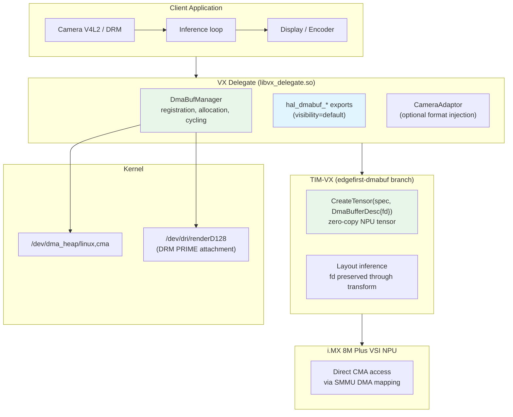
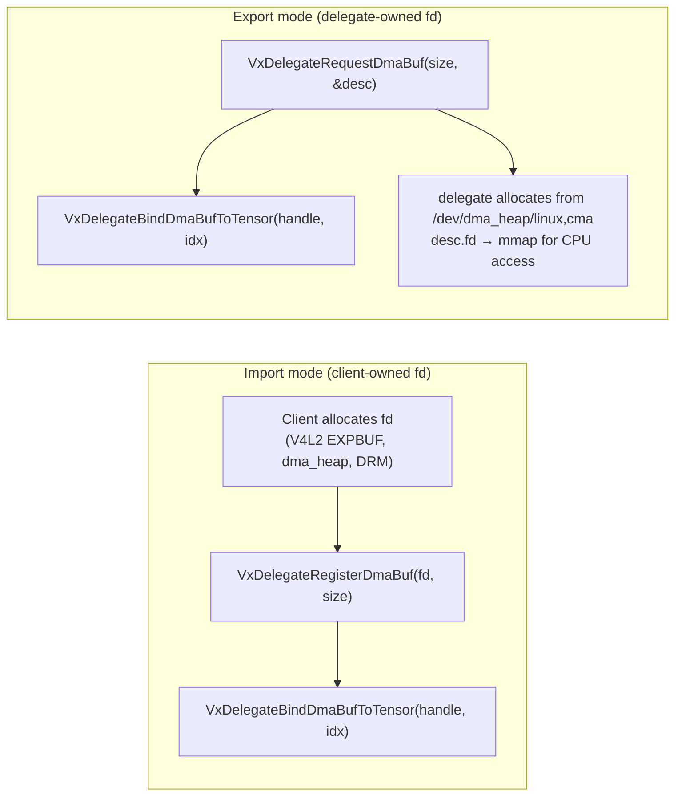
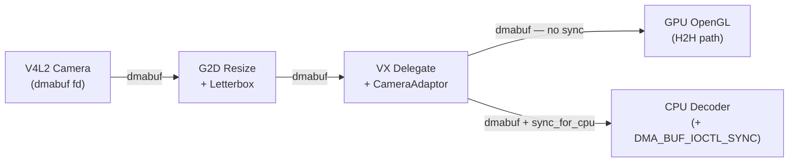
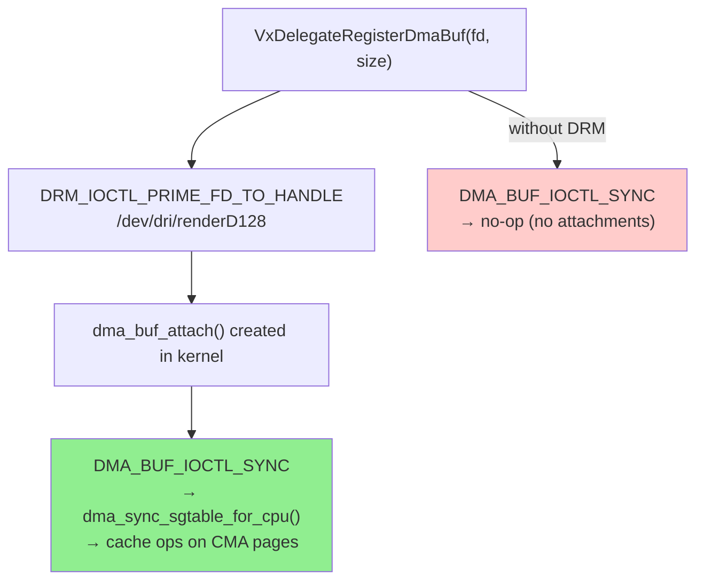
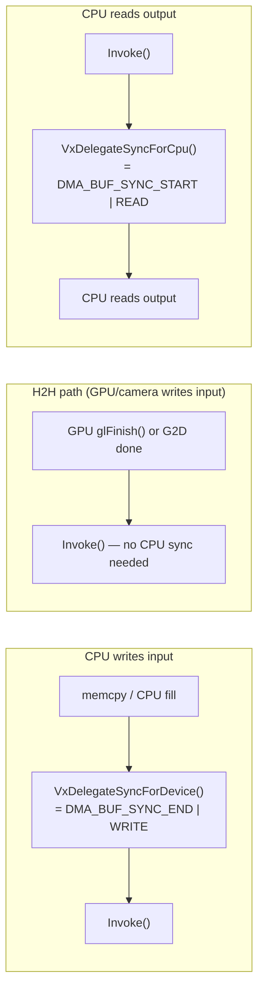
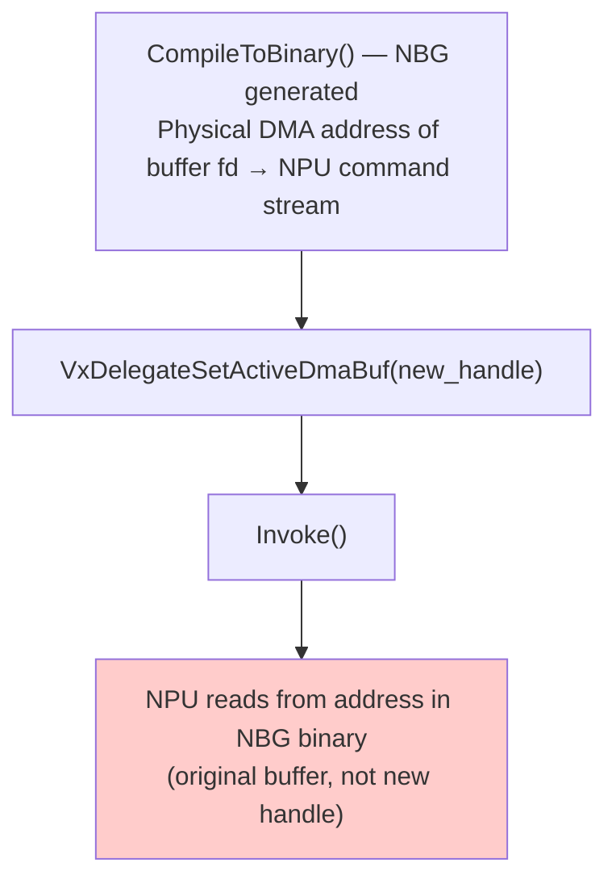

# DMA-BUF Zero-Copy Support for VX Delegate

## Document Information

| Field | Value |
|-------|-------|
| **Author** | Sébastien Taylor <sebastien@au-zone.com> |
| **Version** | 1.7.0 |
| **Date** | 2026-03-27 |
| **Status** | Test Release |

### Changelog

| Version | Date | Description |
|---------|------|-------------|
| 1.7.0 | 2026-03-27 | Full API reference, HAL API section, export mode documented, buffer cycling technical analysis, cross-references |
| 1.6.0 | 2026-02-13 | DRM PRIME import, cache sync documentation, buffer cycling investigation |

---

## Overview

This document describes the DMA-BUF zero-copy API for the TFLite VX Delegate on NXP i.MX 8M Plus. The implementation enables applications to share DMA buffers directly with the VSI NPU, eliminating CPU memcpy from the inference data path.

### Key Features

- **Zero-copy input and output**: NPU reads and writes CMA DMA-BUFs directly
- **Export mode**: Delegate allocates buffers on behalf of the caller
- **DRM PRIME auto-attach**: `DMA_BUF_IOCTL_SYNC` is automatically effective on cached CMA heaps
- **HAL API**: Backend-agnostic `hal_dmabuf_*` symbols for cross-delegate portability
- **CameraAdaptor**: NPU-injected format conversion, see [CAMERAADAPTOR.md](CAMERAADAPTOR.md)
- **Backward compatible**: Existing copy-based applications work unchanged

### Why Zero-Copy?

The copy-based path requires `memcpy` on every inference:

- Latency proportional to buffer size (1.9 MB input at ~142 MB/s ≈ 13 ms for YOLOv8n 640×640)
- Doubles memory footprint (CPU copy + NPU copy)
- Prevents hardware-to-hardware (H2H) pipelines where no CPU involvement is needed

Zero-copy eliminates these copies. For H2H pipelines (camera→NPU→display/encoder), no CPU cache operations are needed at all.

---

## Architecture

### Software Stack



### Buffer Ownership Models

The VX delegate supports two ownership models:



### Example Video Analytics Pipeline



---

## Performance Benchmarks

All benchmarks performed on NXP i.MX 8M Plus FRDM with Vivante VIP8000 NPU.

### Benchmark Methodology

| Mode | Sequence |
|------|----------|
| Copy-based | `memcpy_in` → `Invoke()` → `memcpy_out` |
| Zero-copy | `Invoke()` → `sync_for_cpu` (output only) |

Output sync is only required when CPU reads the output. H2H pipelines (no CPU output access) skip `sync_for_cpu` entirely and save the times shown below.

### Important: Synthetic Benchmark Limitations

These are **synthetic benchmarks** for sanity-checking the zero-copy implementation. Copy-based times appear faster than real-world because:

- **Cache-hot buffers**: Same input every iteration stays in L1/L2 cache
- **No CPU contention**: No concurrent video decode or preprocessing
- **No buffer cycling**: Real V4L2 pipelines cycle through 3–4 buffers, causing cache misses
- **1 MB L2**: Small inputs (≤1 MB) fit entirely in cache; memcpy reads from cache, not DRAM

Real camera pipelines with concurrent CPU workloads will show larger zero-copy benefits.

### Results

| Model | I/O Size | Copy-based | Zero-copy | Difference |
|-------|----------|------------|-----------|------------|
| MobileNet 224×224 | 148 KB | 3,516 µs | 3,814 µs | +298 µs (cache-hot) |
| YOLOv8n 640×480 | 1.8 MB | 64,286 µs | 63,971 µs | −315 µs |
| YOLOv8n 640×640 | 1.9 MB | 68,438 µs | 67,734 µs | −704 µs |
| YOLOv8n 1024×768 | 4.6 MB | 167,951 µs | 165,110 µs | −2,841 µs |
| YOLOv8n 1280×1280 | 7.5 MB | 287,775 µs | 280,659 µs | −7,116 µs |

Zero-copy benefits scale with buffer size. Large buffers benefit from both eliminated `memcpy` and reduced NPU invoke time (direct CMA access vs. copy-destination memory).

---

## API Reference

All APIs are declared in `vx_delegate_dmabuf.h`. The delegate must be created with `enable_dmabuf = true`.

```cpp
VxDelegateOptions options = VxDelegateOptionsDefault();
options.enable_dmabuf = true;
TfLiteDelegate* delegate = VxDelegateCreate(&options);
```

> **`TfLiteExternalDelegateCreate()` users**: This wrapper hides the inner `DerivedDelegateData*` pointer. Always call `VxDelegateGetInstance(delegate)` to get the inner pointer before calling any `VxDelegate*` or `hal_dmabuf_*` functions.

### Singleton Access

| Function | Signature | Description |
|----------|-----------|-------------|
| `VxDelegateGetInstance` | `(TfLiteDelegate*) → TfLiteDelegate*` | Unwraps the external delegate wrapper. Required when using `TfLiteExternalDelegateCreate`. |

### Support Check

| Function | Signature | Description |
|----------|-----------|-------------|
| `VxDelegateIsDmaBufSupported` | `(TfLiteDelegate*) → bool` | Returns true if `/dev/dma_heap` was opened successfully. |

### Import Mode (Client-Owned Buffers)

| Function | Signature | Description |
|----------|-----------|-------------|
| `VxDelegateRegisterDmaBuf` | `(delegate, fd, size, sync_mode) → TfLiteBufferHandle` | Register a client-provided dmabuf fd. Automatically creates DRM PRIME attachment. |
| `VxDelegateUnregisterDmaBuf` | `(delegate, handle) → TfLiteStatus` | Unregister. Does **not** close the fd (client retains ownership). |
| `VxDelegateGetDmaBufFd` | `(delegate, handle) → int` | Retrieve the fd associated with a handle. |

### Export Mode (Delegate-Allocated Buffers)

| Function | Signature | Description |
|----------|-----------|-------------|
| `VxDelegateRequestDmaBuf` | `(delegate, size, align, ownership, desc*) → TfLiteBufferHandle` | Allocate from `/dev/dma_heap/linux,cma` with 64-byte NPU alignment. Fills `desc.fd` and `desc.size`. Caller must provide `desc.size` (from `tensor->bytes` after `AllocateTensors()`). |
| `VxDelegateReleaseDmaBuf` | `(delegate, handle) → TfLiteStatus` | Release delegate-allocated buffer. Closes the fd. |

### Tensor Binding

| Function | Signature | Description |
|----------|-----------|-------------|
| `VxDelegateBindDmaBufToTensor` | `(delegate, handle, tensor_index) → TfLiteStatus` | Bind a registered/allocated buffer to a TFLite tensor index. |

### Cache Synchronization

| Function | Semantic | ioctl flags |
|----------|----------|-------------|
| `VxDelegateSyncForDevice` | Flush CPU caches before NPU reads | `DMA_BUF_SYNC_END \| WRITE` |
| `VxDelegateSyncForCpu` | Invalidate CPU caches before CPU reads | `DMA_BUF_SYNC_START \| READ` |
| `VxDelegateBeginCpuAccess` | Begin CPU access with explicit sync mode | `DMA_BUF_SYNC_START \| mode` |
| `VxDelegateEndCpuAccess` | End CPU access with explicit sync mode | `DMA_BUF_SYNC_END \| mode` |

`VxDelegateSyncForDevice` = `EndCpuAccess(Write)`. `VxDelegateSyncForCpu` = `BeginCpuAccess(Read)`.

`VxDmaBufSyncMode`: `kVxDmaBufSyncNone`, `kVxDmaBufSyncRead`, `kVxDmaBufSyncWrite`, `kVxDmaBufSyncReadWrite`.

### Buffer Cycling

Buffer cycling allows switching between a pool of input buffers (e.g., V4L2 ring) without rebinding tensors. See [Buffer Cycling Limitation](#buffer-cycling-limitation) for the current technical constraint.

| Function | Signature | Description |
|----------|-----------|-------------|
| `VxDelegateSetActiveDmaBuf` | `(delegate, tensor_index, handle) → TfLiteStatus` | Set the active buffer for a tensor before `Invoke()`. |
| `VxDelegateGetActiveBuffer` | `(delegate, tensor_index) → TfLiteBufferHandle` | Get the currently active handle. Falls back to first bound handle. |
| `VxDelegateInvalidateGraph` | `(delegate) → TfLiteStatus` | Mark graph as needing recompilation on next `Invoke()`. |
| `VxDelegateIsGraphCompiled` | `(delegate) → bool` | Returns `false` if invalidation is pending. |

---

## HAL API

`hal_dmabuf.h` is a self-contained C header that exposes the same capability via an opaque `hal_delegate_t` handle. It is used by language bindings, NNStreamer, and cross-delegate consumers (Neutron and VX delegates export the same symbols).

See [EdgeFirst HAL ARCHITECTURE.md](https://github.com/EdgeFirstAI/hal/blob/main/ARCHITECTURE.md) for the full ABI specification.

### Types

```c
typedef void *hal_delegate_t;

typedef struct hal_dmabuf_tensor_info {
    size_t size;
    size_t offset;                   /* always 0 for VX delegate (one fd per tensor) */
    size_t shape[HAL_DMABUF_MAX_NDIM];
    size_t ndim;                     /* 0 until after first Invoke() */
    int    fd;                       /* borrowed — do NOT close */
    hal_dtype dtype;                 /* HAL_DTYPE_U8 until after first Invoke() */
} hal_dmabuf_tensor_info;

typedef struct hal_camera_adaptor_format_info {
    int  input_channels;
    int  output_channels;
    char fourcc[8];
} hal_camera_adaptor_format_info;
```

### Functions

| Function | Returns | Notes |
|----------|---------|-------|
| `hal_dmabuf_get_instance()` | `hal_delegate_t` | Inner delegate handle (unwraps external wrapper). |
| `hal_dmabuf_is_supported(delegate)` | `int` 1/0 | Does not set errno. |
| `hal_dmabuf_get_tensor_info(delegate, idx, info*, info_size)` | `int` 0/−1 | `shape`/`dtype` valid only after first `Invoke()`. |
| `hal_dmabuf_sync_for_device(delegate, idx)` | `int` 0/−1 | Flush before NPU reads. |
| `hal_dmabuf_sync_for_cpu(delegate, idx)` | `int` 0/−1 | Invalidate after NPU writes. |
| `hal_camera_adaptor_is_supported(delegate, format)` | `int` 1/0 | `delegate` unused. |
| `hal_camera_adaptor_get_format_info(delegate, format, info*, info_size)` | `int` 0/−1 | Fills channels and FourCC. |

**errno values**: `EINVAL` (bad args), `ENOTSUP` (dmabuf not enabled), `ERANGE` (tensor index not found), `EIO` (ioctl failure).

---

## Cache Synchronization

### DRM PRIME Attachment (Automatic)

On cached CMA heaps (`/dev/dma_heap/linux,cma`), the kernel's `dma_buf_begin_cpu_access()` iterates the buffer's attachment list to invoke `dma_sync_sgtable_for_cpu()`. **Without an active attachment, `DMA_BUF_IOCTL_SYNC` is a complete no-op** — no cache invalidation or flush occurs, and CPU reads after NPU writes will see stale data.

`DmaBufManager` automatically creates a DRM PRIME attachment (`DRM_IOCTL_PRIME_FD_TO_HANDLE` on `/dev/dri/renderD128`) for every registered or allocated buffer. This GEM handle is held for the buffer's lifetime and released on unregister/release. The attachment makes `DMA_BUF_IOCTL_SYNC` effective.



Clients do not need to perform this step. If `/dev/dri/renderD128` is unavailable, a warning is logged and sync ioctls may be no-ops on cached heaps. The uncached heap (`/dev/dma_heap/linux,cma-uncached`) avoids this requirement entirely.

### Client Sync Responsibility

The delegate does **not** perform automatic cache synchronization in the zero-copy path. This is intentional: H2H pipelines (camera→NPU→display) require no cache operations at all.



### DMA→CPU→DMA Chain (Invalidate–Modify–Flush)

When CPU modifies a buffer between two device accesses:

```c
// 1. Invalidate before CPU reads device-written data
VxDelegateBeginCpuAccess(delegate, handle, kVxDmaBufSyncReadWrite);

// 2. CPU modifies buffer
memcpy(mapped_ptr, new_input, size);

// 3. Flush so device sees CPU writes
VxDelegateEndCpuAccess(delegate, handle, kVxDmaBufSyncReadWrite);

// Safe to call Invoke() — NPU sees CPU's modifications
interpreter->Invoke();
```

---

## Usage Examples

### Import Mode: Client-Provided Buffer

```cpp
#include "vx_delegate.h"
#include "vx_delegate_dmabuf.h"

// 1. Create delegate and interpreter
VxDelegateOptions opts = VxDelegateOptionsDefault();
opts.enable_dmabuf = true;
TfLiteDelegate* delegate = VxDelegateCreate(&opts);

interpreter->ModifyGraphWithDelegate(delegate);
interpreter->AllocateTensors();

int input_idx  = interpreter->inputs()[0];
int output_idx = interpreter->outputs()[0];

// 2. Provide your own fds (from V4L2, dma_heap, DRM, etc.)
int input_fd  = /* from VIDIOC_EXPBUF or DMA_HEAP_IOCTL_ALLOC */;
int output_fd = /* from DRM or dma_heap */;

// 3. Register and bind
TfLiteBufferHandle in_h  = VxDelegateRegisterDmaBuf(delegate, input_fd,  input_size,  kVxDmaBufSyncNone);
TfLiteBufferHandle out_h = VxDelegateRegisterDmaBuf(delegate, output_fd, output_size, kVxDmaBufSyncNone);
VxDelegateBindDmaBufToTensor(delegate, in_h,  input_idx);
VxDelegateBindDmaBufToTensor(delegate, out_h, output_idx);

// 4. Map for CPU fallback access
void* in_ptr  = mmap(NULL, input_size,  PROT_READ|PROT_WRITE, MAP_SHARED, input_fd,  0);
void* out_ptr = mmap(NULL, output_size, PROT_READ|PROT_WRITE, MAP_SHARED, output_fd, 0);

// 5. Inference loop
while (running) {
    memcpy(in_ptr, new_frame_data, input_size);
    VxDelegateSyncForDevice(delegate, in_h);   // flush CPU writes

    interpreter->Invoke();

    VxDelegateSyncForCpu(delegate, out_h);     // invalidate before CPU read
    process_output(out_ptr, output_size);
}

// 6. Cleanup
VxDelegateUnregisterDmaBuf(delegate, in_h);
VxDelegateUnregisterDmaBuf(delegate, out_h);
VxDelegateDelete(delegate);
```

### Export Mode: Delegate-Allocated Buffer

```cpp
// After AllocateTensors() — query tensor size first
size_t input_size = interpreter->input_tensor(0)->bytes;

VxDmaBufDesc desc = {};
desc.size = input_size;
TfLiteBufferHandle in_h = VxDelegateRequestDmaBuf(
    delegate, input_size, 64 /*align*/, kVxDmaBufOwnerDelegate, &desc);
VxDelegateBindDmaBufToTensor(delegate, in_h, input_idx);

// desc.fd is now a delegate-owned dmabuf — mmap for CPU access
void* in_ptr = mmap(NULL, input_size, PROT_READ|PROT_WRITE, MAP_SHARED, desc.fd, 0);

// Inference loop same as import mode ...

VxDelegateReleaseDmaBuf(delegate, in_h);   // closes desc.fd
```

### V4L2 Camera Integration (H2H)

```cpp
// Camera provides dmabuf fd via VIDIOC_EXPBUF
int camera_fd = /* from V4L2 DMABUF export */;
TfLiteBufferHandle h = VxDelegateRegisterDmaBuf(delegate, camera_fd, size, kVxDmaBufSyncNone);
VxDelegateBindDmaBufToTensor(delegate, h, input_idx);

// H2H inference — no CPU sync needed, hardware manages coherency
interpreter->Invoke();
```

---

## Buffer Cycling Limitation

Buffer cycling allows switching the active input buffer (e.g., from a V4L2 ring of 3–4 buffers) between `Invoke()` calls via `VxDelegateSetActiveDmaBuf()` without rebinding tensors.

### Current Constraint

The `VxDelegateSetActiveDmaBuf()` API is implemented and the handle tracking works correctly. However, **cycling does not take effect on the VSI NPU** because physical DMA addresses are baked into the compiled NBG binary during `CompileToBinary()`:



Three approaches were investigated, all with the same root cause:

| Approach | API | Result | Why |
|----------|-----|--------|-----|
| Pool tensor swap | `vxSwapTensor()` | Success reported, NPU reads old buffer | Pool tensors not connected to graph ops |
| SwapHandleWithCache | `vxSwapTensorHandleWithCache()` | Same failure | Cache mechanism only works for NBG nodes already in cache list |
| Direct fd swap | `vxSwapTensorHandle(fd, new_fd)` | Old ptr returned, NPU ignores | Updates host-side structs only; physical address in NBG is immutable |

### Workaround

For multi-buffer V4L2 pipelines, use a single registered input buffer and `memcpy` from V4L2 buffers into it. This loses the zero-copy benefit for the input stage but avoids the ~20 ms graph recompilation that a full re-bind would require.

A driver-level fix would require the Vivante firmware to support indirect addressing (pointer table patchable at runtime) or a DMABUF-aware swap API that re-maps physical addresses in the compiled NBG without full recompilation.

---

## Build Instructions

### Prerequisites

- NXP i.MX 8M Plus target or compatible
- Yocto SDK (e.g., `yocto-sdk-imx8mp-frdm-6.12.49-2.2.0`)
- TIM-VX [`edgefirst-dmabuf` branch](https://github.com/EdgeFirstAI/tim-vx-imx)

### Build TIM-VX

```bash
source /opt/yocto-sdk-imx8mp-frdm-6.12.49-2.2.0/environment-setup-armv8a-poky-linux

# Required: expose DmaBufferDesc in TIM-VX tensor API
export CXXFLAGS="${CXXFLAGS} -DVX_CREATE_TENSOR_SUPPORT_PHYSICAL"
export CMAKE_CXX_FLAGS="${CMAKE_CXX_FLAGS} -DVX_CREATE_TENSOR_SUPPORT_PHYSICAL"

cd tim-vx-imx && rm -rf build && mkdir build && cd build

cmake .. \
  -DCONFIG=YOCTO \
  -DCMAKE_SYSROOT=${SDKTARGETSYSROOT} \
  -DTIM_VX_ENABLE_TEST=off \
  -DTIM_VX_USE_EXTERNAL_OVXLIB=off \
  -DCMAKE_INSTALL_PREFIX=$(pwd)/install

make -j$(nproc) && make install
```

### Build VX Delegate

```bash
source /opt/yocto-sdk-imx8mp-frdm-6.12.49-2.2.0/environment-setup-armv8a-poky-linux
export CXXFLAGS="${CXXFLAGS} -DVX_CREATE_TENSOR_SUPPORT_PHYSICAL"
export CMAKE_CXX_FLAGS="${CMAKE_CXX_FLAGS} -DVX_CREATE_TENSOR_SUPPORT_PHYSICAL"

cd tflite-vx-delegate-imx && rm -rf build && mkdir build && cd build

cmake .. \
  -DTIM_VX_INSTALL=~/Software/NXP/tim-vx-imx/build/install \
  -DTFLITE_LIB_LOC=${SDKTARGETSYSROOT}/usr/lib/libtensorflow-lite.so \
  -DTFLITE_HOST_TOOLS_DIR=/usr/bin

make -j$(nproc)
```

### Deploy

```bash
scp tim-vx-imx/build/install/lib/libtim-vx.so root@TARGET:/usr/lib/
scp tflite-vx-delegate-imx/build/libvx_delegate.so root@TARGET:/usr/lib/
```

---

## TIM-VX Modifications

Repository: [`github.com/EdgeFirstAI/tim-vx-imx`](https://github.com/EdgeFirstAI/tim-vx-imx) — `edgefirst-dmabuf` branch

Three changes are required in TIM-VX to support DMA-BUF tensors:

### 1. Tensor API Extensions (`include/tim/vx/tensor.h`)

New virtual methods expose the DMA-BUF fd from a compiled tensor:

```cpp
virtual bool HasDmaBuf() const { return false; }
virtual int64_t GetDmaBufFd() const { return -1; }
```

### 2. Layout Inference fd Preservation (`src/tim/transform/layout_inference.cc`)

Without this patch, layout inference creates new tensors that lose the original DMA-BUF fd association. The patch checks the source tensor and recreates inferred I/O tensors with the same `DmaBufferDesc`:

```cpp
if (src_tensor->HasDmaBuf()) {
    tim::vx::DmaBufferDesc desc;
    desc.fd = src_tensor->GetDmaBufFd();
    inferred_tensor = graph->CreateTensor(spec, desc);
}
```

### 3. Alignment Check Bypass (`src/tim/vx/internal/src/vsi_nn_tensor.c`)

The existing alignment validation expects a virtual pointer. DMA-BUF tensors pass an fd (integer), not a pointer, so the check must be skipped:

```c
if (tensor->attr.vsi_memory_type != VSI_MEMORY_TYPE_DMABUF) {
    if (!vsi_nn_IsBufferAligned(data, 64)) { /* error */ }
}
```

---

## Implementation Files

| File | Role |
|------|------|
| `vx_delegate_dmabuf.h` | Public C API — `VxDelegate*` and `VxCameraAdaptor*` functions |
| `vx_delegate_dmabuf.cc` | API implementation — routes to `DmaBufManager` and `camera_adaptor` |
| `dmabuf_manager.h` | `DmaBufManager` class + `DrmAttachment` RAII class + `DmaBufEntry` struct |
| `dmabuf_manager.cc` | Buffer registration, CMA allocation, DRM PRIME attach, TIM-VX tensor creation, cache sync |
| `hal_dmabuf.h` | Self-contained HAL C header — `hal_delegate_t`, `hal_dmabuf_*`, `hal_camera_adaptor_*` |
| `hal_dmabuf.cc` | HAL implementation — wraps `VxDelegate*`, exports with `visibility("default")` |
| `delegate_main.h` | `DerivedDelegateData` definition, `DmaBufManager` ownership, `VxDelegateOptions` |
| `delegate_main.cc` | Zero-copy path in `Invoke()`, `ModifyGraphWithDelegate()` hook for CameraAdaptor |
| `camera_adaptor/` | CameraAdaptor subsystem — see [CAMERAADAPTOR.md](CAMERAADAPTOR.md) |
| `examples/dmabuf_benchmark/` | Benchmark comparing copy vs zero-copy paths with output identity validation |

---

## Troubleshooting

### `DMA_BUF_IOCTL_SYNC` Has No Effect

Most common cause: no DRM PRIME attachment. Verify `/dev/dri/renderD128` exists and is accessible. If the device is unavailable, a warning is logged during `RegisterBuffer()`. Use `/dev/dma_heap/linux,cma-uncached` to bypass cache maintenance entirely.

### Symbol Not Found: `vxTensorSelectLayer`

TIM-VX was built from the wrong branch. Ensure you are using [`edgefirst-dmabuf`](https://github.com/EdgeFirstAI/tim-vx-imx).

### `VX_CREATE_TENSOR_SUPPORT_PHYSICAL` Not Defined

The SDK's `CMAKE_CXX_FLAGS` overwrites `-D` flags passed to cmake. Export the define before cmake invocation:

```bash
export CMAKE_CXX_FLAGS="${CMAKE_CXX_FLAGS} -DVX_CREATE_TENSOR_SUPPORT_PHYSICAL"
```

### Zero-Copy Slower Than Copy-Based

For models with small tensors (≤1 MB total I/O), the copy-based path may be faster because cache-hot buffers already reside in L2. The delegate is fully backward-compatible — do not register dmabufs for those tensors and the standard copy path is used automatically.

---

## Cross-Repository Dependencies

| Repository | Role |
|-----------|------|
| [`EdgeFirstAI/tim-vx-imx`](https://github.com/EdgeFirstAI/tim-vx-imx) (`edgefirst-dmabuf` branch) | TIM-VX with `DmaBufferDesc`, fd preservation, alignment bypass |
| [`EdgeFirstAI/tflite-rs`](https://github.com/EdgeFirstAI/tflite-rs) | Rust + Python bindings (`DmaBuf<'a>`, `PyDmaBuf`) |
| [`EdgeFirstAI/nnstreamer`](https://github.com/EdgeFirstAI/nnstreamer) | NNStreamer consumer (`HalDmaBufAPI` + VX delegate path in `tensor_filter_tensorflow_lite.cc`) |
| [`EdgeFirstAI/hal`](https://github.com/EdgeFirstAI/hal) | HAL ABI specification (`ARCHITECTURE.md`), `edgefirst/hal.h` type definitions |

## References

- [Linux DMA-BUF Documentation](https://www.kernel.org/doc/html/latest/driver-api/dma-buf.html)
- [V4L2 DMABUF API](https://www.kernel.org/doc/html/latest/userspace-api/media/v4l/dmabuf.html)
- [EdgeFirst TIM-VX fork](https://github.com/EdgeFirstAI/tim-vx-imx) — `edgefirst-dmabuf` branch
- [EdgeFirst HAL ARCHITECTURE.md](https://github.com/EdgeFirstAI/hal/blob/main/ARCHITECTURE.md) — Delegate DMA-BUF Framework
