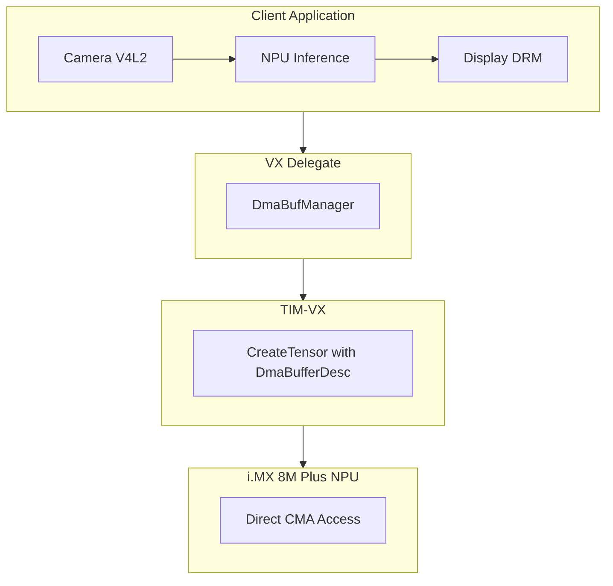
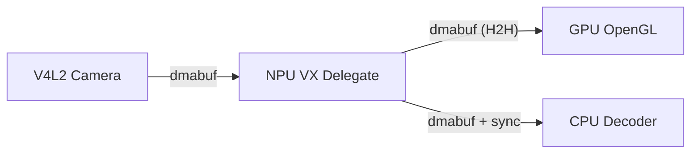

# DMA-BUF Zero-Copy Support for VX Delegate

## Document Information

| Field | Value |
|-------|-------|
| **Author** | Sébastien Taylor <sebastien@au-zone.com> |
| **Version** | 1.6.0 |
| **Date** | 2026-02-13 |

---

## Overview

This document describes the DMA-BUF zero-copy API for the TFLite VX Delegate. The implementation enables applications to share buffers directly with the NPU without memory copies.

### Key Features

- **Zero-copy inference**: Eliminates memcpy between CPU and NPU
- **Backward compatible**: Existing copy-based applications work unchanged
- **Client-controlled sync**: Cache coherency managed by application via dmabuf API
- **CMA memory**: Uses `/dev/dma_heap/linux,cma` for cached contiguous memory

### Why Zero-Copy?

The copy-based approach requires memcpy for every inference:
- Adds latency proportional to buffer size
- Doubles memory footprint (CPU + NPU copies)
- Cannot support async/pipelined video workflows

Zero-copy eliminates these copies. For hardware-to-hardware (H2H) pipelines (camera→NPU→display), no CPU involvement is needed at all.

---

## Current Status

### Working Features

- [x] Zero-copy input path (NPU reads from dmabuf)
- [x] Zero-copy output path (NPU writes to dmabuf)
- [x] Dmabuf fd preservation through TIM-VX layout inference
- [x] Backwards compatibility with non-dmabuf applications
- [x] DRM PRIME import for cache coherent DMA_BUF_IOCTL_SYNC on cached CMA heaps

### Pending Features

- [ ] Buffer cycling for V4L2 buffer pools (see [Known Limitations](#known-limitations---buffer-cycling))
- [ ] Export mode (delegate-allocated buffers)

---

## Performance Benchmarks

All benchmarks performed on NXP i.MX 8M Plus EVK with Vivante NPU.

### Benchmark Methodology

- **Copy-based**: `memcpy_in` → `invoke` → `memcpy_out`
- **Zero-copy**: `invoke` → `output_sync`

Output sync (`DMA_BUF_IOCTL_SYNC`) is only required when CPU reads the output. For hardware-to-hardware pipelines (camera→NPU→display/encoder), no output sync is needed.

### Important: Synthetic Benchmark Limitations

These are **synthetic benchmarks** designed for sanity checking the zero-copy implementation. The copy-based path appears faster than real-world scenarios because:

- **Cache-hot buffers**: Same input data every iteration keeps buffers in L1/L2 cache
- **No CPU contention**: Benchmark has exclusive CPU access with no other workloads
- **No buffer cycling**: Real V4L2 pipelines rotate through multiple buffers, causing cache misses
- **i.MX 8M Plus L2 cache**: 1 MB shared L2 means small inputs (≤1 MB) fit entirely in cache

Real-world camera/video pipelines will show larger benefits from zero-copy due to cache pressure from video decode, preprocessing, and other concurrent CPU work.

### Summary

| Model | I/O Size | Copy-based | Zero-copy | Difference |
|-------|----------|------------|-----------|------------|
| MobileNet 224×224 | 148 KB | 3,516 µs | 3,814 µs | +298 µs (slower) |
| YOLOv8n 640×480 | 1.8 MB | 64,286 µs | 63,971 µs | -315 µs |
| YOLOv8n 640×640 | 1.9 MB | 68,438 µs | 67,734 µs | -704 µs |
| YOLOv8n 1024×768 | 4.6 MB | 167,951 µs | 165,110 µs | -2,841 µs |
| YOLOv8n 1280×1280 | 7.5 MB | 287,775 µs | 280,659 µs | -7,116 µs |

**Key insights**:
- Zero-copy benefits scale with buffer size
- Small inputs that fit in cache see no benefit (or slight regression)
- Large buffers benefit from both eliminated memcpy AND faster NPU invoke
- Real camera pipelines with buffer cycling will show larger improvements

**For H2H pipelines** (no CPU output access): The zero-copy times above include output_sync (5–414 µs depending on buffer size). Pure H2H pipelines skip this sync entirely, providing additional savings.

---

## Architecture

### Software Stack



**DmaBufManager** tracks registered buffers, maps fd to TfLiteBufferHandle, and binds handles to tensor indices.

**TIM-VX** creates tensors backed by dmabuf and preserves the fd through layout inference.

**NPU** accesses dmabuf memory directly via CMA with no CPU copies in the data path.

### Example Pipeline

The following diagram shows a typical video analytics pipeline with two output paths: H2H (GPU rendering) and CPU post-processing.



**H2H Path (GPU)**: Camera writes to dmabuf, NPU reads/writes dmabuf, GPU renders from dmabuf. No CPU cache operations needed—all hardware devices access memory directly.

**CPU Path**: Same as H2H but requires `DMA_BUF_IOCTL_SYNC` before CPU reads the output buffer to ensure cache coherency.

---

## API Reference

All APIs are declared in `vx_delegate_dmabuf.h`.

### Delegate Options

```cpp
VxDelegateOptions options = VxDelegateOptionsDefault();
options.enable_dmabuf = true;  // Enable dmabuf API
TfLiteDelegate* delegate = VxDelegateCreate(&options);
```

### Buffer Registration

| Function | Description |
|----------|-------------|
| `VxDelegateRegisterDmaBuf()` | Register client-provided dmabuf fd |
| `VxDelegateUnregisterDmaBuf()` | Unregister a buffer |
| `VxDelegateBindDmaBufToTensor()` | Bind buffer to tensor index |
| `VxDelegateIsDmaBufSupported()` | Check platform support |

### Cache Synchronization

| Function | Description |
|----------|-------------|
| `VxDelegateSyncForDevice()` | Flush CPU caches before NPU access |
| `VxDelegateSyncForCpu()` | Invalidate caches before CPU read |

---

## Cache Synchronization

### DRM PRIME Import (Automatic)

On cached CMA heaps (`/dev/dma_heap/linux,cma`), the kernel's `begin_cpu_access`
implementation iterates over the buffer's attachment list to perform cache
maintenance via `dma_sync_sgtable_for_cpu()`. **If no device has attached to
the DMA-buf, `DMA_BUF_IOCTL_SYNC` is a complete no-op** — no cache invalidation
or flush occurs, and CPU reads after NPU writes will see stale data.

The `DmaBufManager` automatically creates a persistent DRM PRIME import
(`DRM_IOCTL_PRIME_FD_TO_HANDLE` via `/dev/dri/renderD128`) for every registered
or allocated buffer. This creates a `dma_buf_attach` in the kernel that makes
`DMA_BUF_IOCTL_SYNC` effective. The GEM handle is held for the buffer's lifetime
and released on unregister/release.

**Clients do not need to perform this step** — the delegate handles it
transparently. If `/dev/dri/renderD128` is not available, a warning is logged
and sync ioctls may be no-ops on cached heaps. Using the uncached heap
(`/dev/dma_heap/linux,cma-uncached`) avoids this requirement entirely since
GPU writes are immediately visible to CPU reads without cache maintenance.

### Client Responsibility

**The delegate does NOT perform cache synchronization in the zero-copy path.** This is intentional to support true hardware-to-hardware pipelines where no CPU cache operations are needed.

The VX Delegate provides `VxDelegateSyncForDevice()` and `VxDelegateSyncForCpu()` helper functions for convenience, but client applications can also use the Linux DMA-BUF API directly. See the [Linux DMA-BUF documentation](https://docs.kernel.org/driver-api/dma-buf.html) for complete details.

### Memory Type

DMA-BUF buffers are allocated from `/dev/dma_heap/linux,cma` which provides **cached** contiguous memory. This means:
- CPU access is fast (cached)
- Sync ioctls are required when switching between CPU and device access
- No sync needed for pure H2H pipelines

### DMA-CPU-DMA Chain (Invalidate-Modify-Flush)

When the CPU modifies a buffer in a DMA→CPU→DMA workflow, the proper cache synchronization pattern is:

1. **Invalidate** before CPU read: Ensures CPU sees latest data written by DMA device
2. **Modify**: CPU reads/writes the buffer
3. **Flush** after CPU write: Ensures DMA device sees CPU's modifications

```c
#include <linux/dma-buf.h>
#include <sys/ioctl.h>

// 1. INVALIDATE: Before CPU reads/writes (get latest DMA data)
struct dma_buf_sync sync = {
    .flags = DMA_BUF_SYNC_START | DMA_BUF_SYNC_RW
};
ioctl(dmabuf_fd, DMA_BUF_IOCTL_SYNC, &sync);

// 2. MODIFY: CPU accesses buffer
memcpy(mapped_ptr, input_data, size);  // or read from mapped_ptr

// 3. FLUSH: After CPU is done (sync back to DMA memory)
sync.flags = DMA_BUF_SYNC_END | DMA_BUF_SYNC_RW;
ioctl(dmabuf_fd, DMA_BUF_IOCTL_SYNC, &sync);

// Now safe to call Invoke() - NPU will see CPU's writes
```

### Hardware-to-Hardware Pipelines

For camera→NPU→display where CPU never touches the data:

```cpp
// No sync needed - hardware devices manage coherency
interpreter->Invoke();
```

---

## Usage Examples

### Complete Zero-Copy Example

This example shows the complete flow from model loading through zero-copy inference. The API is standard TFLite with the VX Delegate plus dmabuf registration.

```cpp
#include "tensorflow/lite/interpreter.h"
#include "tensorflow/lite/kernels/register.h"
#include "tensorflow/lite/model.h"
#include "vx_delegate.h"
#include "vx_delegate_dmabuf.h"
#include <sys/mman.h>

// 1. Load model (standard TFLite)
auto model = tflite::FlatBufferModel::BuildFromFile("model.tflite");
tflite::ops::builtin::BuiltinOpResolver resolver;
std::unique_ptr<tflite::Interpreter> interpreter;
tflite::InterpreterBuilder(*model, resolver)(&interpreter);

// 2. Create VX Delegate with dmabuf enabled
VxDelegateOptions options = VxDelegateOptionsDefault();
options.enable_dmabuf = true;
TfLiteDelegate* delegate = VxDelegateCreate(&options);

// 3. Apply delegate and allocate tensors
interpreter->ModifyGraphWithDelegate(delegate);
interpreter->AllocateTensors();

// 4. Get tensor info
int input_idx = interpreter->inputs()[0];
int output_idx = interpreter->outputs()[0];
size_t input_size = interpreter->input_tensor(0)->bytes;
size_t output_size = interpreter->output_tensor(0)->bytes;

// 5. Allocate dmabufs (or receive from V4L2/DRM)
int input_fd = /* from dma_heap_alloc() or V4L2 VIDIOC_EXPBUF */;
int output_fd = /* from dma_heap_alloc() or DRM */;

// 6. Register and bind dmabufs to tensors
auto in_handle = VxDelegateRegisterDmaBuf(delegate, input_fd, input_size, kVxDmaBufSyncNone);
VxDelegateBindDmaBufToTensor(delegate, in_handle, input_idx);

auto out_handle = VxDelegateRegisterDmaBuf(delegate, output_fd, output_size, kVxDmaBufSyncNone);
VxDelegateBindDmaBufToTensor(delegate, out_handle, output_idx);

// 7. Map for CPU access (once, before inference loop)
void* in_ptr = mmap(NULL, input_size, PROT_READ|PROT_WRITE, MAP_SHARED, input_fd, 0);
void* out_ptr = mmap(NULL, output_size, PROT_READ|PROT_WRITE, MAP_SHARED, output_fd, 0);

// 8. Inference loop
while (running) {
    // Fill input (with sync if CPU writes)
    // ...

    interpreter->Invoke();

    // Read output (with sync if CPU reads)
    // ...
}

// 9. Cleanup
munmap(in_ptr, input_size);
munmap(out_ptr, output_size);
VxDelegateUnregisterDmaBuf(delegate, in_handle);
VxDelegateUnregisterDmaBuf(delegate, out_handle);
VxDelegateDelete(delegate);
```

### V4L2 Camera Integration

```cpp
// Camera provides dmabuf fd via VIDIOC_EXPBUF
int camera_fd = /* from V4L2 DMABUF export */;

// Register camera buffer
auto handle = VxDelegateRegisterDmaBuf(delegate, camera_fd, size, kVxDmaBufSyncNone);
VxDelegateBindDmaBufToTensor(delegate, handle, input_tensor_idx);

// Camera fills buffer directly, no CPU sync needed
interpreter->Invoke();
```

### Buffer Cycling (V4L2 Buffer Pool) - NOT CURRENTLY SUPPORTED

Buffer cycling for V4L2 buffer pools is **not currently viable** due to hardware/driver limitations. See [Known Limitations](#known-limitations---buffer-cycling) for technical details.

**Current workaround**: Use a single DMABUF for the input tensor and memcpy from V4L2 buffers. This loses the zero-copy benefit but avoids the recompilation overhead that would otherwise be required for each buffer switch.

---

## Build Instructions

### Prerequisites

- NXP i.MX 8M Plus target or compatible
- Yocto SDK (e.g., `yocto-sdk-imx8mp-frdm-6.12.49-2.2.0`)
- TIM-VX `edgefirst-dmabuf` branch

### Build TIM-VX

```bash
source /opt/yocto-sdk-imx8mp-frdm-6.12.49-2.2.0/environment-setup-armv8a-poky-linux

# CRITICAL: Add dmabuf support define
export CXXFLAGS="${CXXFLAGS} -DVX_CREATE_TENSOR_SUPPORT_PHYSICAL"
export CMAKE_CXX_FLAGS="${CMAKE_CXX_FLAGS} -DVX_CREATE_TENSOR_SUPPORT_PHYSICAL"

cd tim-vx-imx
rm -rf build && mkdir build && cd build

cmake .. \
  -DCONFIG=YOCTO \
  -DCMAKE_SYSROOT=${SDKTARGETSYSROOT} \
  -DTIM_VX_ENABLE_TEST=off \
  -DTIM_VX_USE_EXTERNAL_OVXLIB=off \
  -DCMAKE_INSTALL_PREFIX=$(pwd)/install

make -j$(nproc) && make install
```

### Build VX Delegate

```bash
source /opt/yocto-sdk-imx8mp-frdm-6.12.49-2.2.0/environment-setup-armv8a-poky-linux
export CXXFLAGS="${CXXFLAGS} -DVX_CREATE_TENSOR_SUPPORT_PHYSICAL"
export CMAKE_CXX_FLAGS="${CMAKE_CXX_FLAGS} -DVX_CREATE_TENSOR_SUPPORT_PHYSICAL"

cd tflite-vx-delegate-imx
rm -rf build && mkdir build && cd build

cmake .. \
  -DTIM_VX_INSTALL=~/Software/NXP/tim-vx-imx/build/install \
  -DTFLITE_LIB_LOC=${SDKTARGETSYSROOT}/usr/lib/libtensorflow-lite.so \
  -DTFLITE_HOST_TOOLS_DIR=/usr/bin

make -j$(nproc)
```

### Deploy

```bash
scp tim-vx-imx/build/install/lib/libtim-vx.so root@TARGET:/usr/lib/
scp tflite-vx-delegate-imx/build/libvx_delegate.so root@TARGET:/usr/lib/
```

---

## TIM-VX Modifications

The `edgefirst-dmabuf` branch includes these changes:

### 1. Tensor API Extensions (`include/tim/vx/tensor.h`)

```cpp
virtual bool HasDmaBuf() const { return false; }
virtual int64_t GetDmaBufFd() const { return -1; }
```

### 2. Layout Inference (`src/tim/transform/layout_inference.cc`)

Preserves dmabuf fd when creating inferred tensors for I/O:

```cpp
if (src_tensor->HasDmaBuf()) {
    tim::vx::DmaBufferDesc desc;
    desc.fd = src_tensor->GetDmaBufFd();
    inferred_tensor = graph->CreateTensor(spec, desc);
}
```

### 3. Alignment Check (`src/tim/vx/internal/src/vsi_nn_tensor.c`)

Skips pointer alignment validation for dmabuf (fd is not a pointer):

```c
if (tensor->attr.vsi_memory_type != VSI_MEMORY_TYPE_DMABUF) {
    if (!vsi_nn_IsBufferAligned(data, 64)) { /* error */ }
}
```

---

## Implementation Files

| File | Description |
|------|-------------|
| `vx_delegate_dmabuf.h` | Public C API |
| `vx_delegate_dmabuf.cc` | API implementation |
| `dmabuf_manager.h` | Buffer tracking, DrmAttachment class |
| `dmabuf_manager.cc` | DmaBufManager + DrmAttachment implementation |
| `delegate_main.h` | Delegate options, DmaBufManager integration |
| `delegate_main.cc` | Zero-copy path in Invoke() |

---

## Troubleshooting

### Symbol Not Found: vxTensorSelectLayer

TIM-VX was built from wrong branch. Ensure you're using the branch matching your SDK version.

### VX_CREATE_TENSOR_SUPPORT_PHYSICAL Not Defined

The SDK's CMAKE_CXX_FLAGS overwrites cmake -D flags. Export the flags before cmake:

```bash
export CMAKE_CXX_FLAGS="${CMAKE_CXX_FLAGS} -DVX_CREATE_TENSOR_SUPPORT_PHYSICAL"
```

### Zero-copy Slower Than Expected

For models with small tensor I/O (<1 MB total), the copy-based path may be faster due to dmabuf setup overhead when buffers fit entirely in CPU cache. The delegate is fully backwards compatible—simply don't register dmabufs for these tensors and the standard copy path will be used automatically.

---

## Known Limitations - Buffer Cycling

### Problem Statement

V4L2 camera pipelines typically use a ring of 3-4 buffers. For true zero-copy, the delegate would need to switch between these buffers without recompilation overhead. The goal was O(1) buffer switching (~microseconds), but the only working approach requires full graph recompilation (~20ms for MobileNet), which is not viable for real-time pipelines.

### Approaches Investigated

#### 1. Pool Tensor + vxSwapTensor (tensor-to-tensor swap)

Created pool tensors for each non-active buffer after layout inference, then called `vsi_nn_SwapTensorHandle(tensor0, tensor1)` which internally uses `vxSwapTensor()`.

**Result**: SwapHandle reported success, but NPU continued reading from the original buffer.

**Root cause**: Pool tensors weren't connected to any graph operations. The warning "Graph has free input, INPUT tensor may be created but not consumed" confirmed this. The swap mechanism expects both tensors to be bound to operations in the graph.

#### 2. SwapHandleWithCache

Enabled the swap_handle_cache feature via `vsi_nn_SwapTensorHandleWithCache()`, which should rebind tensors via `vxSetParameterByIndex` before graph execution.

**Result**: Same failure - swap reports success but NPU reads from wrong buffer.

**Root cause**: The `_check_swapped_tensors()` function in TIM-VX only processes NBG nodes, and the cache requires tensors to already be in the cache_list (populated only for NBG nodes with swapped tensors).

#### 3. Direct FD Swap (vxSwapTensorHandle with raw pointer)

Bypassed pool tensors entirely and called `vxSwapTensorHandle(tensor, new_fd, &old_ptr)` directly on the active tensor.

**Result**: Function returned success and `old_ptr` was correctly returned, but NPU still read from original physical address.

**Root cause**: For DMABUF tensors, the fd is mapped to a physical address during `CompileToBinary()`. The physical addresses are baked into the NPU command stream (NBG binary). `vxSwapTensorHandle` updates host-side data structures but does not update the addresses in the compiled NBG.

### Fundamental Limitation

When `CompileToBinary()` generates the NPU binary (NBG), **physical DMA addresses are embedded directly into the command stream**. The TIM-VX/OpenVX swap APIs are designed for:
- Regular handle-based tensors (user-space virtual pointers)
- Tensors that are both connected to the same graph operations

They do **not** work for:
- DMABUF tensors where the "handle" is a kernel fd mapped to physical memory
- Swapping to a tensor that isn't already bound to graph operations
- Updating physical addresses in an already-compiled NBG

### What Would Be Needed

For true O(1) buffer cycling with DMABUF, the Vivante driver would need:

1. **DMABUF-aware swap API** that re-maps physical addresses in the compiled NBG without full recompilation, OR
2. **Indirect addressing mode** where the NBG references a pointer table that can be updated at runtime

Neither capability appears to be available in the current TIM-VX/VXC/OpenVX driver stack on i.MX 8M Plus.

### Current Status

Buffer cycling feature is **parked** pending driver-level support. The zero-copy implementation works correctly for single-buffer scenarios (static DMABUF binding).

---

## References

- [Linux DMA-BUF Documentation](https://docs.kernel.org/driver-api/dma-buf.html)
- [V4L2 DMABUF API](https://www.kernel.org/doc/html/latest/userspace-api/media/v4l/dmabuf.html)
- [EdgeFirst tim-vx-imx](https://github.com/EdgeFirstAI/tim-vx-imx) - `edgefirst-dmabuf` branch
